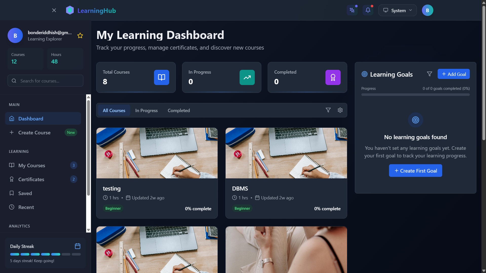
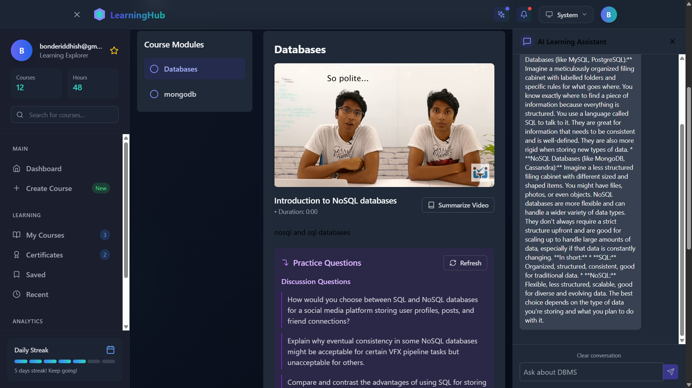

<div align="center">
  
# 🧠 LearnSphere AI

### *Intelligent Learning Management, Reimagined*

[](LICENSE)
[](https://reactjs.org/)
[](https://www.typescriptlang.org/)
[](https://supabase.io/)
[](https://tailwindcss.com/)
[](https://ai.google.dev/)
[](https://lmsplatform-g49kwvsit-bonderiddhish-gmailcoms-projects.vercel.app)

[✨ Live Demo ✨](https://lmsplatform-g49kwvsit-bonderiddhish-gmailcoms-projects.vercel.app)

</div>

---

## 📸 Screenshots

<div align="center">
  <h3>Dashboard View</h3>
  <a href="https://lmsplatform-g49kwvsit-bonderiddhish-gmailcoms-projects.vercel.app">
    
  </a>
  
  <h3>Course View</h3>
  <a href="https://lmsplatform-g49kwvsit-bonderiddhish-gmailcoms-projects.vercel.app">
    
  </a>
  
  <h3>Course Creation</h3>
  <a href="https://lmsplatform-g49kwvsit-bonderiddhish-gmailcoms-projects.vercel.app">
    
  </a>
</div>

---

## 📋 Overview

LearnSphere AI transforms traditional education with **intelligent course management** and **AI-powered learning tools**. Our platform combines intuitive progress tracking, personalized learning paths, and smart content enhancement to create a comprehensive educational ecosystem where students achieve their goals faster and retain knowledge longer.

Built with a responsive design and performance-focused architecture, this platform enables learners to track their progress, set meaningful goals, and receive AI-enhanced content summaries—all within a beautiful, accessible interface that adapts to any device.

---

<div align="center">
  
### ✨ Key Features
  
</div>

### 📚 Comprehensive Course Management 
  
<details>
<summary>Click to expand</summary>

- 🔍 Browse an extensive library of courses
- 📊 Enroll and progress tracking with detailed analytics
- 🧭 Interactive module navigation with completion tracking
- 🗑️ Easily remove unwanted courses from your dashboard
</details>

### 🎯 Smart Learning Goals System

<details>
<summary>Click to expand</summary>

- 📝 Set personalized learning objectives with target dates
- 📈 Track progress across your educational journey
- 🔄 Organize and prioritize goals with intuitive status indicators
- 🏆 Receive achievement notifications upon completion
</details>

### 🧠 AI Integration

<details>
<summary>Click to expand</summary>

- 🤖 **Gemini AI Assistant**
  - Get personalized course recommendations based on learning patterns
  - Receive instant answers to course-related questions
  - Adaptive support tailored to individual learning styles

- 📝 **AI-Generated Content Enhancement**
  - Automatic summaries of complex topics for quick review
  - Key concept extraction from course materials
  - Visual concept mapping for better understanding

- ❓ **Intelligent Assessment Generation**
  - AI-powered quizzes that adapt to your knowledge level
  - Diverse question formats to test comprehensive understanding
  - Spaced repetition suggestions based on performance
</details>

### 🎨 Responsive UI with Dark/Light Mode

<details>
<summary>Click to expand</summary>

- ✅ Beautiful, accessibility-focused interface
- 📱 Seamless device adaptation from mobile to desktop
- 🌙 Eye-friendly dark mode for night-time learning
- 🎬 Motion animations for engaging user experience
</details>

---

<div align="center">
  
## 🛠️ Tech Stack
  
</div>

<table align="center">
  <tr>
    <td align="center">
      <br />
      <strong>React</strong>
    </td>
    <td align="center">
      <br />
      <strong>TypeScript</strong>
    </td>
    <td align="center">
      <br />
      <strong>Tailwind</strong>
    </td>
    <td align="center">
      <br />
      <strong>Supabase</strong>
    </td>
    <td align="center">
      <br />
      <strong>Gemini AI</strong>
    </td>
  </tr>
</table>

- **Frontend**: 
  - React 18 with TypeScript for type-safe development
  - Tailwind CSS for responsive, utility-first styling
  - Framer Motion for fluid animations and transitions
  - Vite for lightning-fast builds and development

- **State Management**: 
  - Zustand for lightweight, hook-based state management
  - Optimized stores with automatic persistence

- **Backend**: 
  - Supabase for serverless PostgreSQL database
  - Real-time data subscriptions
  - Row-level security policies for data protection
  - Built-in authentication and storage solutions

- **AI Integration**: 
  - Google Gemini API for advanced natural language processing
  - Custom prompting techniques for education-specific outputs
  - Efficient context handling for relevant responses

- **Deployment**: 
  - Vercel for global CDN distribution
  - Automatic previews for pull requests
  - Environment variable management for secure configuration

---

## 🚀 Getting Started

### Prerequisites

- Node.js (v16+)
- npm or yarn
- Supabase account
- Google Cloud account (for Gemini API)

### Installation

1. Clone the repository:
   ```bash
   git clone https://github.com/Riddhish1/AI-Enhanced-LMS-Platform.git
   cd AI-Enhanced-LMS-Platform
   ```

2. Install dependencies:
   ```bash
   npm install
   ```

3. Create a `.env` file in the root directory with the following variables:
   ```
   VITE_SUPABASE_URL=your_supabase_url_here
   VITE_SUPABASE_ANON_KEY=your_supabase_anon_key_here
   VITE_GEMINI_API_KEY=your_gemini_api_key_here
   ```

4. Start the development server:
   ```bash
   npm run dev
   ```

5. Open [http://localhost:5174](http://localhost:5174) to view the app in your browser.

---

## 📊 Database Setup

The project uses Supabase as the backend. Database migrations are located in `src/db/migrations/`.

<details>
<summary>Migration Setup Instructions</summary>

1. Install Supabase CLI: 
   ```bash
   npm install -g supabase
   ```
2. Login: 
   ```bash
   supabase login
   ```
3. Link your project: 
   ```bash
   supabase link --project-ref your-project-ref
   ```
4. Apply migrations: 
   ```bash
   supabase db push
   ```
</details>

---

## 🌍 Deployment

This project is deployed at: [LearnSphere AI Platform](https://lmsplatform-g49kwvsit-bonderiddhish-gmailcoms-projects.vercel.app)

<details>
<summary>Deployment Instructions</summary>

1. Install Vercel CLI: 
   ```bash
   npm install -g vercel
   ```
2. Login to Vercel: 
   ```bash
   vercel login
   ```
3. Deploy: 
   ```bash
   vercel --prod
   ```

4. Configure environment variables in the Vercel Dashboard:
   - Go to your project on [Vercel Dashboard](https://vercel.com/dashboard)
   - Navigate to Settings > Environment Variables
   - Add the following variables:
     - `VITE_SUPABASE_URL` - Your Supabase project URL
     - `VITE_SUPABASE_ANON_KEY` - Your Supabase anonymous key
     - `VITE_GEMINI_API_KEY` - Your Google Gemini API key
   - Click "Save" and redeploy your application

> **Important**: After adding environment variables, you must redeploy your application for the changes to take effect.
</details>

---

## 🧩 Project Structure

```
/src
  /components     # Reusable UI components
    /ai           # AI-related components
    /auth         # Authentication components
    /courses      # Course-related components
    /goals        # Learning goals components
    /layouts      # Layout components
    /ui           # Generic UI components
  /db             # Database migrations and schemas
  /lib            # Utility libraries
  /pages          # Main application pages
  /stores         # Zustand stores for state management
  /types          # TypeScript type definitions
```

---

## 🔒 Security

- Row-Level Security policies in Supabase ensure data privacy
- Environment variables protect API keys and sensitive data
- User authentication with Supabase Auth
- API key restrictions for Gemini API access

---

<div align="center">
  
## 📄 License
  
This project is licensed under the [MIT License](LICENSE) - see the LICENSE file for details.

## 🙏 Acknowledgments

[](https://reactjs.org/) 
[](https://vitejs.dev/)
[](https://supabase.io/)
[](https://tailwindcss.com/)
[](https://www.framer.com/motion/)
[](https://ai.google.dev/)

</div> 